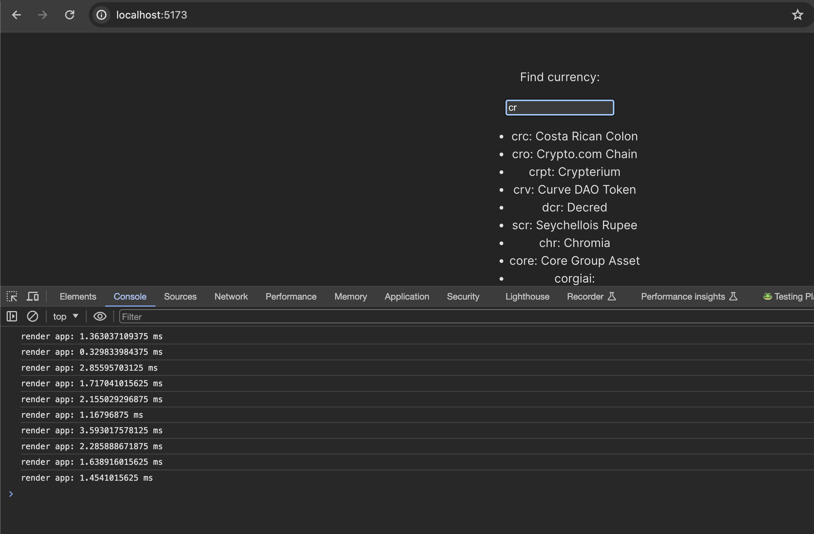
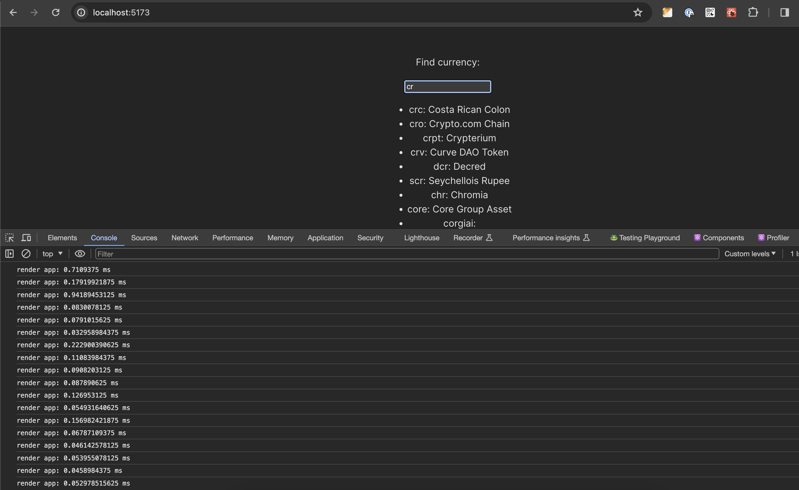

# Fast Search

Do you want to optimize your app? This small app shows how to do it with web workers and the suspense API from React.
(PS. This example will be easier with the new `use` hook that is in beta but it will be stable soon)

# Suspense API and Web Workers

This react API lets you read a value from promises. With that in mind, what if we could have a simple RPC for `postMessage` to use web workers to optimize our react app? It is great that this idea is a reality with Comlink.

From Comlink GitHub:

`"Comlink makes WebWorkers enjoyable. Comlink is a tiny library (1.1kB), that removes the mental barrier of thinking about postMessage and hides the fact that you are working with workers."`

I do not want to forget to mention Vite! For this work, Vite is great. It has a special plugin that makes working and building the app easier than expected :D

# Implementing a fast search in React

Sometimes, we need to perform some heavy tasks in the frontend, like searching, sorting, and/or filtering.

## Let's take a high-level look at the code

We are going to find the currency name by currency symbol. For this case, we are going to use a library called `matchSorter` to filter and sort items. 

We are creating the workers file at `workers` folder. There, you will find the ts file with the search function.

In `lib` folder, you will find `resources.ts` in charge of creating the worker instance and the function to read the promise returned by the worker that will be read by the suspense API.

`Components` folder contains two react components: `CurrencyList.tsx` to display the list of currencies and `CurrencySearch.tsx` in charge of reading the promise resource from the worker and passing the data to the currency list.

Last but not least, `App.tsx` is responsible for handling the search input, debouncing the value to provide a better UX, and creating a new resource each time the search value changes.

Simple but efficient, you can use web workers to have faster renders and optimize your react app, running heavy tasks in background threads.

## High-level step-by-step to use web workers.

First things first, add `vite-plugin-comlink` to your project and modify `vite.config.ts` to use the plugin. With that ready, you will be able to work easily with workers. As mentioned in their GitHub: "This plugin removes the need to call expose, wrap from comlink and also you don't need to create the worker on your own."

Then, creating the worker is as simple as creating another TS/JS file and exporting whatever you want! In this case, I am exporting a small function to use `matchSorter` to find and sort in the currency list. Take a look at `workers/search.ts`

Next part, how can we use the worker? we have to create an instance! And using the Comlink vite plugin is as simple as importing the file and creating the worker instance. No need to wrap and expose the worker as mentioned on the ComLink page. Take a look at `lib/resources.ts`

Now, we have the worker instance, and calling its methods is as simple as using async/await. But wait! That means you don't need to use the postMessage method and basically, you are handling a promise. And you know what works really well with promises, don't you?

Suspense API is great for working with promises without async/await, useEffects, and so on. Let's create the resource using `createWorkerResource` in `lib/resources.ts` passing in the worker method call as a param `createWorkerResource(searchWorker.search(currencies, value))`. Easy, right? Now suspense will take care of rendering the component when the promise is fulfilled.

And now, it is time to enjoy faster renders, levering the complex and resource-consuming tasks to web workers!


## Comparing searching in the main thread and searching in a web worker

Let's take a look at the time it takes to render the currency list when searching in the main thread.

Average time for this test was ~1.85 ms

<details>
<summary>Want to test the search in the main thread? Copy/paste this code</summary>

```
function CurrencyList({ list }: { list: [string, string][] }) {
  return (
    <ul>
      {list.map(([symbol, name]) => (
        <li key={symbol + name}>
          {symbol}: {name}
        </li>
      ))}
    </ul>
  );
}

function App() {
  console.time("render app");
  const [value, setValue] = useState("");

  const debounced = useDebouncedCallback((value: string) => {
    setValue(value);
  }, 0);

  const list = matchSorter(currencies, value, { keys: ["0"] });

  const UI = (
    <div>
      <p>Find currency:</p>
      <input defaultValue={""} onChange={(e) => debounced(e.target.value)} />
      <CurrencyList list={list} />
    </div>
  );
  console.timeEnd("render app");

  return UI;
}
```
</details>





Now, take a look at the time when using web workers.

Average time is ~0.25ms




That is a huge improvement, isn't it? I know in this example we are talking about milliseconds but with workers, rendering is 7.4x faster. Now, imagine what you can do in a real case where the performance needs a boost!